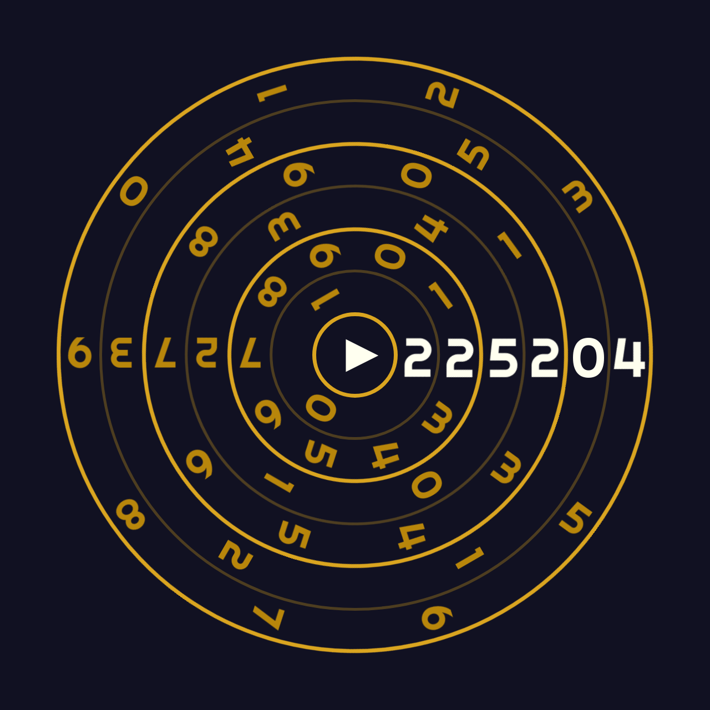

# Spinning Clock

This project is a visually engaging spinning clock implemented using HTML5, CSS, and JavaScript. It features rotating numerical displays for hours, minutes, and seconds, with each time segment represented by its own spinning component. The clock is designed to create a dynamic and visually interesting way to display the current time.

## Features
- **Rotating Time Segments**: The clock is composed of individual spinning components for each digit of hours, minutes, and seconds, creating a visually striking effect as time changes.
- **Class-Based Styling and Animation**: CSS classes are used to animate the spinning components, providing smooth transitions between numbers.
- **Responsive Layout**: The clock elements dynamically adjust their size and positioning to ensure proper display on different devices and screen sizes.

## Files
- **index.html**: Contains the main HTML structure of the webpage, including the time spinner elements, and references the CSS and JavaScript files.
- **style.css**: Handles the styling and layout of the clock, including the design of the spinning components and positioning them within the container.
- **index.js**: Implements the logic for updating the time and managing the spinning animations using JavaScript functions that add, remove, or toggle CSS classes.

## Technologies Used
- **HTML5**: To create the webpage structure and spinning clock elements.
- **CSS3**: To style the webpage, manage the layout, and define the spinning animations for the clock.
- **JavaScript**: To control the real-time update of the clock and manage the spinning animations using JavaScript functions.

## Screenshot

## License
This project is open-source and available under the MIT License.
